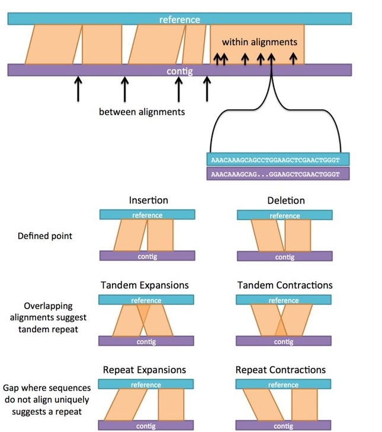
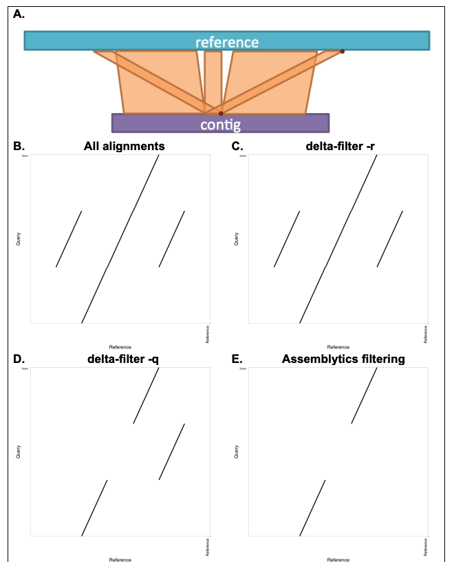

# Assemblytics: detect variants from an assembly

If you use Assemblytics, please cite our paper in Bioinformatics: http://www.ncbi.nlm.nih.gov/pubmed/27318204

BioRxiv preprint also available: https://www.biorxiv.org/content/10.1101/044925v1

## How Assemblytics works

Assemblytics analyzes alignments of a "query" assembly to a "reference" genome (or another assembly) to identify structural variants. The pipeline consists of the following key steps:

1. **Unique Anchor Filtering:** For every alignment, Assemblytics calculates how much of the query sequence is "unique" (not covered by any other alignments). Alignments are only retained if they meet a minimum unique anchor length requirement (default 10,000 bp). This ensures that variants are called from high-confidence, non-repetitive regions.
2. **Calling Variants Between Alignments:** Assemblytics identifies variants that occur in the gaps between adjacent alignments of the same query sequence. These include insertions, deletions, and tandem expansions/contractions that occur when the assembly and reference don't quite meet up.
3. **Calling Variants Within Alignments:** The pipeline also scans within individual alignments for mismatches in the gap sizes on the reference vs. query side.
4. **Integration and Categorization:** All identified variants are combined and categorized by type (Insertion, Deletion, Tandem Expansion/Contraction, Repeat Expansion/Contraction) and size.
5. **Visualization and Summary:** Finally, the tool generates summary statistics and several plots, including a dot plot of filtered alignments, an Nchart of the assembly, and size distributions of all called variants.

## How to use Assemblytics

1. Align your assembly fasta file to some kind of reference you want to compare against. See `nucmer` input instructions below for the exact command we recommend.
2. Go to [assemblytics.com](https://assemblytics.com) and input your .delta file for analysis. 

Important: Use only contigs rather than scaffolds from the assembly. This will prevent false positives when the number of Ns in the scaffolded sequence does not match perfectly to the distance in the reference.

## `nucmer` input instructions

See my [MUMmer tutorial on sandbox.bio](https://sandbox.bio/tutorials/mummer-circa).

IMPORTANT: Assemblytics was built for `nucmer -maxmatch` output and tuned to the following parameters, which is important for making the unique anchor filtering in Assemblytics work correctly.

Upload a delta file to analyze alignments of an assembly to another assembly or a reference genome

1. Download and install [MUMmer 4](https://github.com/mummer4/mummer/releases).
2. Align your assembly to a reference genome using nucmer (from MUMmer package)
```bash
nucmer -maxmatch -l 100 -c 500 REFERENCE.fa ASSEMBLY.fa -prefix OUT
# Settings above are important for unique anchor filtering to work correctly in Assemblytics.
# I increased -l to 10000 for the human in input_examples, which cut down on file size significantly at the cost of losing a lot of sensitivity and thus alignments. I don't really recommend setting it that high for your main analysis, but it can be useful for a fast initial run.

# Optionally gzip
gzip OUT.delta
```

Consult the [MUMmer github](https://github.com/mummer4/mummer/releases) if you encounter problems.

3. Use the output .delta or .delta.gz file at assemblytics.com

## FAQ

### What do the different variant types mean? What is tandem expansion versus repeat expansion?



### What is unique anchor filtering for?
See this example showing the point of unique anchor filtering (from the bioRxiv preprint supplementary materials): 

<sub>
<b>Supplementary Figure 1 caption:</b> Each repetitive element in a genome assembly can map ambiguously to multiple locations in the reference genome. Delta-filter, a component of MUMmer, filters repetitive alignments using a longest-increasing subsequence (LIS) dynamic programming algorithm to select subsets of long, high-identity alignments while penalizing overlaps (Kurtz et al., 2004; Phillippy et al., 2008). In contrast, Assemblytics eliminates repeats lacking substantial unique anchoring sequence (default: 10 kb). <b>A</b>. Example: a simulated 20 kb contig sequence matches three locations in the reference except for a single nucleotide (red point) providing a better match on the right. <b>B</b>. Dot plot of all raw, unfiltered alignments from nucmer. <b>C</b>. Dot plot after <code>delta-filter -r</code> (equivalent to unfiltered). <b>D</b>. Dot plot after <code>delta-filter -q</code>; here, a single nucleotide is enough for <code>-q</code> to prefer the third alignment. <b>E</b>. Dot plot after Assemblytics unique anchor filtering: only alignments with at least 10 kb uniquely anchored sequence (aligning to a single position in the reference) are retained; the repeats are removed. Assemblytics annotates structural variants within such filtered gaps as repeat expansions or contractions, depending on whether the gap is larger in the query or reference, respectively. No variant is reported unless the gap size changes, so repeats themselves are not reported as SVs—only expansions (increased size) or contractions (decreased size) are.
</sub>

For small genomes (e.g. bacteria), you may want to reduce the unique_length to 1000.

### How long does the analysis take?

The analysis will run in a few seconds for most genomes, and for the human example which is a 6 MB gzipped delta, it takes 50 seconds. It should scale linearly with file size, so expect at least a minute per 10MB. On assemblytics.com, it runs client-side meaning using your computer's own CPU, so if you are working on a really slow computer, it could run somewhat slower. If it's an issue, see nucmer instructions note on `-l` above, or consider running the python version.

### What aligners can I use?

Assemblytics was built on [MUMmer 3](https://sourceforge.net/projects/mummer/files/) but MUMmer 4 is still compatible. Other aligners do not produce .delta files but rather SAM/BAM outputs, which MUMmer 4 also supports now, but MUMmer was sort of the original aligner for genome assemblies (as opposed to reads), so that's what Assemblytics was built to work with. Many choices about which alignments are kept are also going to be different from other aligners, so I don't recommend using Assemblytics with anything other than MUMmer.

### why no translocations?

By default, candidate variants that span two different reference chromosomes ("Interchromosomal") are left out of the main results, since most of them come from misassemblies rather than real variants. Pass `--long-range` to also write these candidates to a separate `assemblytics_long_range_variants.bed`, so they're easy to find but clearly kept apart from the main, higher-confidence call set:

```bash
assemblytics -d input_examples/ecoli.delta.gz -o ecoli_output --long-range

# In addition to the usual output, this also writes ecoli_output/assemblytics_long_range_variants.bed.
# These candidates are usually misassemblies, but can occasionally be real translocations or
# other large-scale rearrangements -- review them manually before trusting them as true variants.
```

## Python-only version for pipelines

The python part of Assemblytics can be run without the web app.
Depends on Python 3.8+, and includes `numpy`, `pandas`, and `matplotlib` dependencies.

```bash
pip install assemblytics
```

The `assemblytics` command orchestrates the entire pipeline from filtering to plotting.

```bash
assemblytics -d <delta_file> -o <output_dir>
```

Example using the provided *E. coli* sample:
```bash
assemblytics -d input_examples/ecoli.delta.gz -o ecoli_output

# The output should match the one in the output_examples/ecoli folder.
```

## Development instructions

### Python

```bash
git clone https://github.com/MariaNattestad/assemblytics.git
cd assemblytics
pip install -e .
assemblytics
```

### Local web app

The web app (`public/`) runs the entire Assemblytics pipeline client-side in the browser via [Pyodide](https://pyodide.org/) (Python compiled to WebAssembly) in a Web Worker. There is no server-side code, no upload step, and no installation beyond a static file server — your delta file never leaves your machine.

To run it locally, serve the `public/` folder with any static file server, for example:

```bash
cd assemblytics
python3 -m http.server 8000 --directory public
# Then open http://localhost:8000 in your browser
```

The Python source lives in `assemblytics/` at the repo root. The web app loads it as a Python wheel (`public/assemblytics-2.0.0-py3-none-any.whl`) installed at runtime by Pyodide's `micropip`.

After editing any Python files under `assemblytics/`, rebuild the wheel before testing or deploying:

```bash
make wheel
```

This runs `python3 -m build --wheel` and copies the result into `public/`. If you bump the version in `pyproject.toml`, also update the filename on line 18 of `public/worker.js` to match.

## Testing

`output_examples/` contains pre-computed results for five organisms, generated from the delta files in `input_examples/`. These are kept around (and untouched by any refactoring) specifically so the pipeline's correctness can be checked by re-running it and comparing the variant calls. The most important file to compare is `assemblytics_structural_variants.bed` (the combined, final set of structural variant calls) — everything else (plots, indices, summary stats) is derived from it.

To re-run the pipeline on each input and diff its variant calls against the matching example output:

```bash
# E. coli (uses a smaller unique anchor length since it's a small genome)
assemblytics -d input_examples/ecoli.delta.gz -o /tmp/assemblytics_test/ecoli -l 1000
diff <(tail -n +2 /tmp/assemblytics_test/ecoli/assemblytics_structural_variants.bed | sort) \
     <(tail -n +2 output_examples/ecoli/E__coli_example.Assemblytics_structural_variants.bed | sort) \
     && echo "ecoli: OK"

# Yeast (Saccharomyces cerevisiae)
assemblytics -d input_examples/yeast.delta.gz -o /tmp/assemblytics_test/yeast
diff <(tail -n +2 /tmp/assemblytics_test/yeast/assemblytics_structural_variants.bed | sort) \
     <(tail -n +2 output_examples/yeast/Saccharomyces_cerevisiae_example.Assemblytics_structural_variants.bed | sort) \
     && echo "yeast: OK"

# Arabidopsis thaliana
assemblytics -d input_examples/arabidopsis.delta.gz -o /tmp/assemblytics_test/arabidopsis
diff <(tail -n +2 /tmp/assemblytics_test/arabidopsis/assemblytics_structural_variants.bed | sort) \
     <(tail -n +2 output_examples/arabidopsis/Arabidopsis_example.Assemblytics_structural_variants.bed | sort) \
     && echo "arabidopsis: OK"

# Drosophila melanogaster
assemblytics -d input_examples/drosophila.delta.gz -o /tmp/assemblytics_test/drosophila
diff <(tail -n +2 /tmp/assemblytics_test/drosophila/assemblytics_structural_variants.bed | sort) \
     <(tail -n +2 output_examples/drosophila/Drosophila_example.Assemblytics_structural_variants.bed | sort) \
     && echo "drosophila: OK"

# Human (assembly aligned to hg19) -- the largest input, this one takes the longest to run
assemblytics -d input_examples/human.delta.gz -o /tmp/assemblytics_test/human
diff <(tail -n +2 /tmp/assemblytics_test/human/assemblytics_structural_variants.bed | sort) \
     <(tail -n +2 output_examples/human/Human_NA12878_to_hg19.Assemblytics_structural_variants.bed | sort) \
     && echo "human: OK"
```

(No `pip install -e .` yet? Run these from inside `public/` instead, replacing `assemblytics` with `python -m assemblytics.cli` and adjusting the `input_examples/`/`output_examples/` paths to `../input_examples/`/`../output_examples/`.)

Each `diff` should print nothing (no differences) followed by the "OK" line. The `tail -n +2` skips the header line, and `sort` makes the comparison order-independent since variant IDs can legitimately be assigned in a different order between runs.
